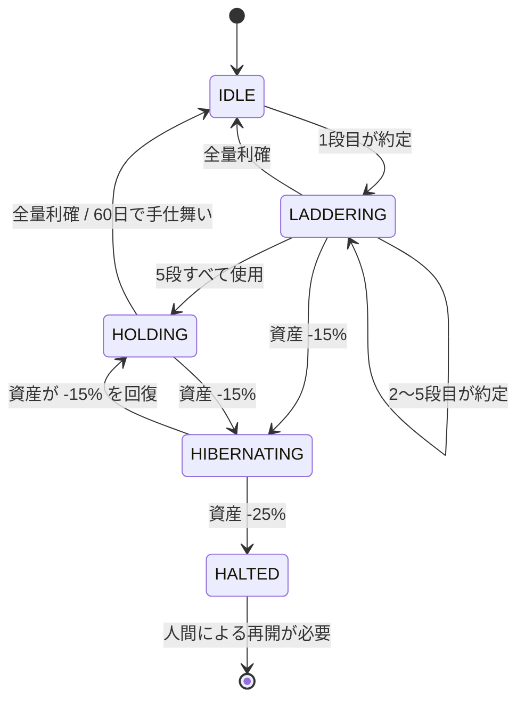

# 戦略 — ナンピノニクス

> 数値パラメータの正は `agent.yaml` です。本書は「なぜその設計なのか」を説明します。
> 値が食い違う場合は `agent.yaml` を優先してください。

## 前提

- 対象：`btc_jpy`（第1段階は1銘柄のみ）
- 資金：ペーパートレード 1,000,000 JPY
- 実行間隔：15分
- 発注は**指値主体**。`bitbank paper` は GTC 指値のみ・部分約定なしで、
  `paper tick` が1分足を遡って約定を判定します。15分間隔の成行では拾えない
  下ヒゲを、置いておいた指値なら拾える — この設計に合わせています。

## アンカー価格

すべての判断の基準点を **アンカー＝直近7日の日足高値** とします。

```
bitbank candles btc_jpy --type=1day --format=json --machine
```

アンカーは毎回計算し直します。上昇相場ではアンカーも切り上がるため、
「高値から何％落ちたか」という相対的な見方が常に維持されます。

**現在価格がアンカー以上のとき、新規買いは行いません。** 追いかけないためです。

## 買い下がりの階段（ナンピン）

5段の階段を用意します。1段目だけアンカー基準、2段目以降は**直前の約定価格**基準です。

| 段  | 基準       | 下落率 | 予算 (JPY) |
| --- | ---------- | ------ | ---------- |
| 1   | アンカー   | -3%    | 80,000     |
| 2   | 直前の約定 | -3%    | 100,000    |
| 3   | 直前の約定 | -4%    | 120,000    |
| 4   | 直前の約定 | -5%    | 140,000    |
| 5   | 直前の約定 | -6%    | 160,000    |
|     |            | 合計   | **600,000** |

設計上の意図：

- **段の間隔を下ほど広げる**（3→3→4→5→6%）。下落が続くほど慎重になります。
- **予算は緩やかにしか増やさない**（80k→160k、2倍まで）。倍々に張るマーチンゲールは採りません。
- **合計は初期資金の 60%**。残り 40% は使いません（`risk-policy.md`）。

### ペース制御

階段を1日で駆け下りないための制約です。

- 未約定の買い指値は**同時に2本まで**（次の2段だけ板に置く）
- 約定したら**6時間**は次の段を発注しない
- 1日の約定は**2回まで**

### 想定例（アンカー = 15,000,000 JPY）

| 段  | 指値価格   | 予算    | 数量     |
| --- | ---------- | ------- | -------- |
| 1   | 14,550,000 | 80,000  | 0.005498 |
| 2   | 14,113,500 | 100,000 | 0.007085 |
| 3   | 13,548,960 | 120,000 | 0.008857 |
| 4   | 12,871,512 | 140,000 | 0.010877 |
| 5   | 12,099,221 | 160,000 | 0.013224 |

5段すべて約定した場合：取得原価 600,000 JPY / 0.045541 BTC、
**平均取得単価 約 13,175,000 JPY**（アンカーから -12.2%）。
階段を使い切るのはアンカーから -19.3% まで落ちたときです。

## 決済

平均取得単価を基準に、2段階で利確します。

| 段階 | 条件            | 売却量   |
| ---- | --------------- | -------- |
| 1    | 平均取得単価 +3% | 建玉の 50% |
| 2    | 平均取得単価 +6% | 残り全量   |

上の例なら +3% は 13,570,000 JPY — アンカーから見ればまだ -9.5% の水準です。
ナンピンで下がった平均取得単価のぶん、戻りが浅くても利確できます。

利確注文も**指値**で常時板に置きます。買いが約定して平均取得単価が動いたら、
既存の売り指値をキャンセルして置き直します。

**時間切れ**：建玉の保有が 60 日を超えたら、損益に関わらず全量手仕舞いします。
戻らない相場に資金を縛られ続けないための制約です。

## HOLD する条件

以下のいずれかに当てはまるとき、何もしません。

- 現在価格がアンカー以上（追わない）
- 次の段の指値価格に届いていない
- クールダウン中（前回約定から6時間以内）
- 本日すでに2回約定済み
- 階段を使い切っており、利確条件にも未達
- 取引所がメンテナンス中、またはサーキットブレイク発動中
- 取得データが5分より古い、または CLI がエラーを返した

最後の2つは重要です。**判断に迷ったら HOLD。** 例外時に発注してはいけません。

## 状態遷移



`HIBERNATING`（冬眠）では新規買いを止めますが、利確の売り指値は残します。
`HALTED`（停止）は全建玉を成行で手仕舞い、人間が再開するまで動きません。

## 15分ごとの処理

```bash
# 1. 市場が正常か
bitbank status --format=json --machine
bitbank circuit-break btc_jpy --format=json --machine

# 2. 価格とアンカー
bitbank ticker  btc_jpy --format=json --machine
bitbank candles btc_jpy --type=1day --format=json --machine

# 3. 置いてある指値の約定を解決
bitbank paper tick

# 4. 自分の状態
bitbank paper assets        --format=json --machine
bitbank paper pnl           --pair=btc_jpy --format=json --machine
bitbank paper active-orders --format=json --machine

# 5. BUY / SELL / HOLD を判断

# 6. 必要なら発注・取消
bitbank paper create-order --pair=btc_jpy --side=buy --type=limit --price=<段の価格> --amount=<数量>
bitbank paper cancel-order --pair=btc_jpy --order-id=<id>

# 7. 判断ログを追記し、status.yaml を更新
```

## 実装前に確認が必要な点

- `bitbank candles` の `--type` に指定できる値の一覧（README には `1day` の例のみ）。
  `1hour` を短期判定に使う想定だが、実装時に実際の CLI で確認する。
- `paper create-order` の数量の刻み・最小注文量。`bitbank pairs` で取得して丸める。
- `paper tick` を15分ごとに呼んだときの、直前 tick 以降の1分足の遡り範囲。
