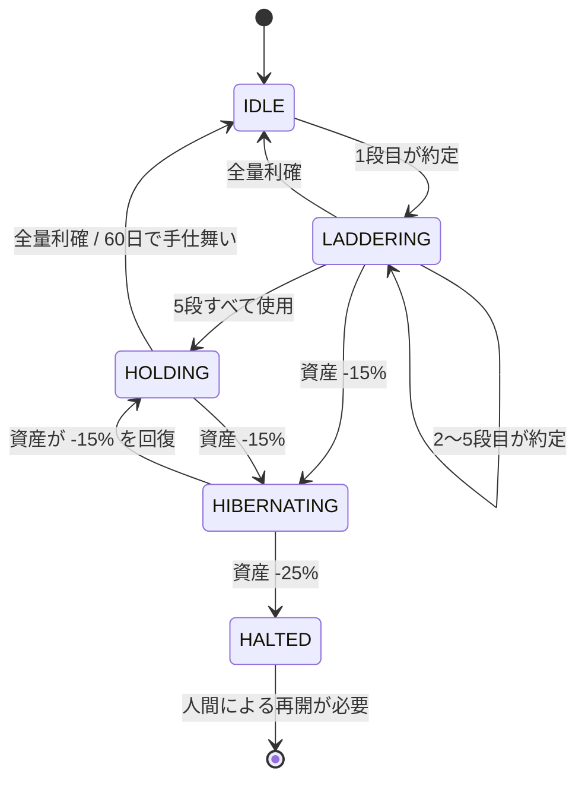

# 戦略 — ナンピノニクス

> 数値パラメータの正は `agent.yaml` です。本書は「なぜその設計なのか」を説明します。
> 値が食い違う場合は `agent.yaml` を優先してください。

## 前提

- 対象：`btc_jpy`（第1段階は1銘柄のみ）
- 資金：ペーパートレード 1,000,000 JPY
- 実行間隔：15分
- 発注は**指値主体**。`bitbank paper` の指値は GTC のみ・部分約定なしで、
  `paper tick` が前回 tick 以降の1分足を遡って約定を判定します。15分間隔の
  成行では拾えない下ヒゲを、置いておいた指値なら拾える — この設計に合わせています。
- **成行（`--type=market`）も使えます。** last 価格で即時約定します。
  時間切れの手仕舞いと `HALTED` の強制手仕舞いは、こちらを使います。

## アンカー価格

すべての判断の基準点を **アンカー＝直近2時間の15分足高値** とします。

```
bitbank candles btc_jpy --type=15min --from=<前日> --to=<当日> --format=json --machine
```

日中足は UTC の日ごとに区切られるため、境界をまたいでも2時間ぶんを満たせるよう
前日から取得します。取れた足が期待本数の半分に満たないときは、狭い高値を掴まないよう
判断せず HOLD します。

アンカーは毎回計算し直します。上昇局面ではアンカーも切り上がるため、
「直近の高値から何％落ちたか」という相対的な見方が常に維持されます。

直近2時間には**進行中の未確定足も含めます。** 高値を更新している最中は
現在価格がアンカーと等しくなり、次の `no_chase` が働きます。

**現在価格がアンカー以上のとき、新規買いは行いません。** 追いかけないためです。

### なぜ2時間・15分足なのか

2026-07-19〜08-18 の15分足（2,940本）で実測しました。

| アンカー | 下落率 | 約定/日 | +0.3%到達 | 到達までの中央値 |
| -------- | ------ | ------- | --------- | ---------------- |
| 1時間    | -0.5%  | 5.6     | 76.7%     | 1.25 時間        |
| **2時間** | **-0.5%** | **9.8** | **72.9%** | **2.88 時間** |
| 4時間    | -0.8%  | 7.7     | 59.5%     | 2.75 時間        |
| 8時間    | -1.2%  | 7.0     | 53.3%     | 5.00 時間        |

同じ約定回数でも、**アンカーが短いほど到達率が高く、戻りも速い**という結果でした。
1日あたりの回数を優先して 2時間・-0.5% を採ります。

## 買い下がりの階段（ナンピン）

5段の階段を用意します。1段目だけアンカー基準、2段目以降は**直前の約定価格**基準です。

| 段  | 基準       | 下落率 | 予算 (JPY) |
| --- | ---------- | ------ | ---------- |
| 1   | アンカー   | -0.5%  | 80,000     |
| 2   | 直前の約定 | -0.5%  | 100,000    |
| 3   | 直前の約定 | -0.7%  | 120,000    |
| 4   | 直前の約定 | -1.0%  | 140,000    |
| 5   | 直前の約定 | -1.5%  | 160,000    |
|     |            | 合計   | **600,000** |

設計上の意図：

- **段の間隔を下ほど広げる**（0.5→0.5→0.7→1.0→1.5%）。下落が続くほど慎重になります。
- **予算は緩やかにしか増やさない**（80k→160k、2倍まで）。倍々に張るマーチンゲールは採りません。
- **合計は初期資金の 60%**。残り 40% は使いません（`risk-policy.md`）。

15分足の値幅は中央値 0.090%、1日の値幅は中央値 1.77% でした（同じ実測）。
1段目の -0.5% は日常的に届き、5段すべてを使うにはアンカーから -4.13% の下落が要ります。

### ペース制御

階段を数分で駆け下りないための制約です。

- 未約定の買い指値は**同時に2本まで**
- 約定したら**30分**は次の段を発注しない
- 1日の約定は**16回まで**（実測 9.8 回/日に対する余裕）

なお、2段目以降の指値価格は**直前の約定価格**から決まるため、1段目が約定するまで
2段目の価格は確定しません。そのため実際に板へ置ける買い指値は**常に1本**です。
`max_pending_buy_orders` の 2 は上限として残しますが、通常は届きません。

### 想定例（アンカー = 10,000,000 JPY）

| 段  | 指値価格  | 予算    | 数量   |
| --- | --------- | ------- | ------ |
| 1   | 9,950,000 | 80,000  | 0.0080 |
| 2   | 9,900,250 | 100,000 | 0.0101 |
| 3   | 9,830,948 | 120,000 | 0.0122 |
| 4   | 9,732,638 | 140,000 | 0.0143 |
| 5   | 9,586,648 | 160,000 | 0.0166 |

5段すべて約定した場合：取得原価 約 597,845 JPY / 0.0612 BTC、
**平均取得単価 約 9,768,712 JPY**（アンカーから -2.31%）。
階段を使い切るのはアンカーから -4.13% まで落ちたときです。

### 発注数量の求め方

上の表は予算を価格で割っただけの概算です。実際の発注では2つの調整が必要です。

1. **手数料ぶんを差し引く。** 買い指値は `価格 × 数量 × (1 + maker手数料率)` を
   JPY 側でロックします。予算ちょうどの数量では残高不足で弾かれます。

   ```
   数量 = 予算 ÷ (価格 × (1 + max(maker手数料率, 0)))
   ```

   手数料率は `bitbank pairs` の `maker_fee_rate_quote` を毎回取得します。
   改定と campaign で変わり、リベートで負にもなるためです。負の値は 0 として
   扱います（CLI が取得に失敗したときのフォールバックは 0.0012 であり、
   そちらでロックされても足りるようにするため）。

2. **刻みに丸める。** CLI は丸めません。`unit_amount` の整数倍でなければ
   エラーで拒否されます。**切り捨て**で丸めます。価格も `price_digits` 以内にします。

## 決済

平均取得単価を基準に、2段階で利確します。

| 段階 | 条件              | 売却量     |
| ---- | ----------------- | ---------- |
| 1    | 平均取得単価 +0.3% | 建玉の 50% |
| 2    | 平均取得単価 +0.6% | 残り全量   |

上の例なら +0.3% は 9,798,018 JPY — アンカーから見ればまだ -2.0% の水準です。
ナンピンで下がった平均取得単価のぶん、戻りが浅くても利確できます。

**利確幅をここまで浅くできるのは、手数料が maker 0% だからです。**
入りも出も指値なら往復コストは 0 で、+0.3% がそのまま利益になります。
成行を使うのは時間切れと強制手仕舞いだけで、そのときだけ taker 0.1% がかかります。

利確注文も**指値**で常時板に置きます。買いが約定して平均取得単価が動いたら、
既存の売り指値をキャンセルして置き直します。

**時間切れ**：建玉の保有が 3 日を超えたら、損益に関わらず全量手仕舞いします。
実測では +0.3% への到達の中央値が 2.88 時間、24時間以内の到達が 72.9% でした。
3日戻らない建玉は、この戦略が想定する値動きから外れています。

## HOLD する条件

以下のいずれかに当てはまるとき、何もしません。

- 現在価格がアンカー以上（追わない）
- 次の段の指値価格に届いていない
- クールダウン中（前回約定から30分以内）
- 本日すでに2回約定済み
- 階段を使い切っており、利確条件にも未達
- 売り指値の取消が「すでに約定していた」で返った（`risk-policy.md`）
- 24時間を超える停止からの復帰直後（`risk-policy.md`）
- 取引所がメンテナンス中、またはサーキットブレイク発動中
- 取得データが5分より古い、または CLI がエラーを返した

最後の2つは重要です。**判断に迷ったら HOLD。** 例外時に発注してはいけません。

## 状態遷移



`HIBERNATING`（冬眠）では新規買いを止めますが、利確の売り指値は残します。
`HALTED`（停止）は全建玉を成行で手仕舞い、人間が再開するまで動きません。

## 15分ごとの処理

```bash
# 1. 市場が正常か
bitbank status --format=json --machine
bitbank circuit-break btc_jpy --format=json --machine

# 2. 価格とアンカー
bitbank ticker  btc_jpy --format=json --machine
bitbank candles btc_jpy --type=15min --from=<前日> --to=<当日> --format=json --machine

# 3. 置いてある指値の約定を解決（--pair は付けない。理由は後述）
bitbank paper tick

# 4. 自分の状態
bitbank paper assets        --format=json --machine
bitbank paper pnl           --pair=btc_jpy --format=json --machine
bitbank paper active-orders --format=json --machine

# 5. BUY / SELL / HOLD を判断

# 6. 必要なら発注・取消
bitbank paper create-order --pair=btc_jpy --side=buy --type=limit --price=<段の価格> --amount=<数量>
bitbank paper cancel-order --id=<id>

# 7. 判断ログを追記し、status.yaml を更新
```

## 実装で踏む CLI の仕様

`bitbank-lab-cli` の実装で確認済みの事項です。

- **`candles` の `--type`**：`1min` / `5min` / `15min` / `30min` / `1hour` / `4hour` /
  `8hour` / `12hour` / `1day` / `1week` / `1month`。
- **日中足は UTC の日で区切られる**：`--type=15min` は既定で当日（UTC）ぶんしか返しません。
  日境界の直後でもアンカーの2時間を満たせるよう、`--from` に前日を指定して取得します。
- **数量と価格は丸めてもらえない**：`unit_amount` の整数倍でない数量、
  `price_digits` を超える価格は、エラーで拒否されます。丸めは発注側の責任です。
- **手数料は CLI が適用する**：指値は必ず maker、成行は taker。レートは
  `/spot/pairs` 由来のライブ値です。`paper pnl` は買い手数料を平均取得単価へ
  上乗せし、売り手数料を実現損益から差し引きます。
  **自分で手数料を計算し直しません。**
- **lazy tick**：`paper assets` / `paper trade-history` / `paper active-orders` /
  `paper create-order` は、呼ぶたびに裏で約定判定を走らせます。明示的な
  `paper tick` は省略できますが、順序を固定するため15分の処理では最初に呼びます。
- **`paper tick` に `--pair` を付けない**：pair 限定の部分 tick は `lastTickAt` を
  進めないため、遡り区間が伸び続けて 24 時間の上限に当たります。
- **`paper cancel-order` は取消より約定を優先する**：取消の前に必ず約定判定が
  走ります。`open order not found ... (may have already filled)` が返ったときの
  扱いは `risk-policy.md`「発注と取消の競合」に従います。
- **遡りの上限は24時間**：24時間を超えて停止したあとの復帰手順は
  `risk-policy.md`「運用を中断したあとの復帰」に従います。
- **状態ファイル**：既定は `~/.bitbank/paper-state.json`。
  環境変数 `BITBANK_PAPER_STATE_PATH` で変更できます。
